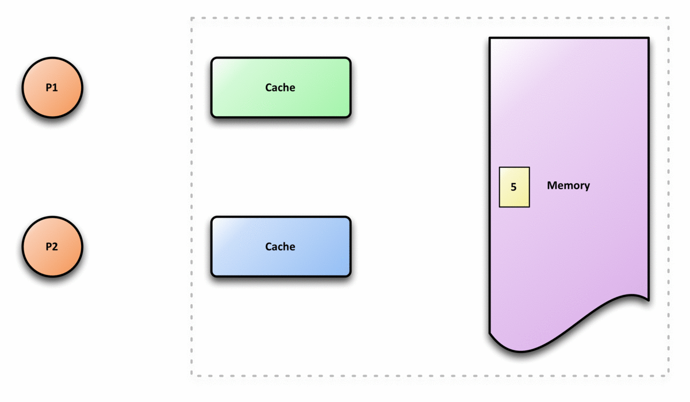

# Common Problems

## Shared memory programming

OpenMP assumes that the underlying memory is **shared**
among all processes, or **threads** as they are called.
This means that all threads share variables, allocated memory for pointers and so on by default. We must specify
if some variable is to be specific to a particular thread.
The terminology OpenMP uses for this is a **private** variable.

There are two very important concepts to understand
when you parallelize with OpenMP.

### False sharing
```{note}
This is a technical concept, and you might be better suited to return to this at a later point.
```

If more than one thread uses a memory block stored in the **cache** (a type of fast memory used by your cpu), any change to it will require all the threads that uses it to make the exact same update to their version of the memory block. This is imposed by what is known by the **cache-coherence policy**. The punchline is that this leads to performance degradation. This process is called false sharing.
  - Example: If two threads P1 and P2 work on the same variable X. Then cache coherence is enforced as illustrated in the following gif:



#### Example 1: adding to the same global variable


### Race condition
```{note}
This is a technical concept, and you might be better suited to return to this at a later point.
```


Suppose two threads are to increment a variable *v* that is initially set to zero, i.e `v = 0`. The ideal result is that the final value should be `v = 2`. This will happen if the following sequence of events occur:

1. Thread 1 reads the value of `v` from memory.
2. Thread 1 adds 1 to `v` and writes it back to memory.
3. Only after this, thread 2 performs the exact same action.

The following scenario describes when it goes wrong:

1. Thread 1 reads the value of `v` from memory.
2. Thread 2 reads the value of `v` from memory *before* thread 1 adds 1 and writes it back to memory.
3. Both thread 1 and 2 now adds 1 to `v` and writes it back to memory. But the value both of them read was `v = 0`, so the final value written to memory will be `v = 1`.


We can of course create more scenarios in which this happens, but the main idea to take from this is:
when two threads operate on the same memory address, they must do so sequentially. Sometimes, absurd results from your program can boil down to this process, so it's important to be aware of it for debugging purposes.


## Measuring speedup

A way to quantify the performance gained by parallelization is to measure **speedup**.
Speedup is defined as the time a single thread uses divided by the time *p* threads uses, i.e

```sh
speed = time_by_one_thread/time_by_p_threads
```
In an ideal world, the speed up is *p*.

It's natural to wonder *how many threads will give the optimal speedup?* Modern processors use computing units called **cores**. Many of these support **hyper-threading**, which typically means that each core yield two threads. A rule-of-thumb is to use the maximum number of threads supported (i.e twice the number of cores, if the cpu supports hyper-threading). However, it's wise to perform a performance analysis for you specific program, measure the speedup as a function of number of threads and decide based on the results you obtain.
