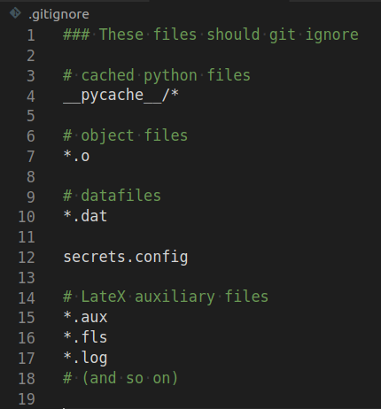

# Add a README and gitignore

## README
Make sure to add (and keep up to date) a file `README.md` at the base directory of your Git repo. GitHub will suggest adding such a file when you register a new repo. The README file should contain a short explanation of how your repository is organized, and what commands others have to run in order to build and use the various codes.

You can format the file nicely using Markdown syntax, but it is also OK to just write plain text.

## gitignore
As with README, GitHub will also suggest adding a `.gitignore` file to your repository. A gitignore file is a file that contains a list of all the files that Git should *not* track changes for.

### Why ignore certain files?
Some files you do not want Git to track. This can for instance be because they are large data files, auxiliary files that are not useful for anything else than the program that generated them, or configuration files containing sensitive information. Here are some examples particularly relevant for our course:

  - Git has a file size limit of 100MB, and GitHub will give you a warning if you push a file larger than 50MB. Tracking changes in very large files reduces performance and can make Git noticably slow. 

  - When running Python codes, you will often get a folder called `__pycache__`. This folder is generated and used by the Python interpreter at runtime -- it's not directly useful for you or others browsing your code, so there's no need to have Git track it.

  - Any *compiled* C++ files, either executables or object files (e.g. files like `main.o`), do not need to be tracked by Git. 

  - When using LaTeX you will typically end up with a lot of auto-generated files with strange file extensions in your folder. (These are generated when you compile the pdf document.) All these files are perfectly happy being left alone -- there's no need to track them with Git.

When typing `git status` in the terminal, you will get a list of all the tracked files that *have* changed, and then a list of all new files that Git is *not* currently tracking and that are *not* listed in your gitignore file. Having a gitignore file helps making sure that these lists are so cluttered that you miss adding files that you do want Git to track:

### How to make a gitignore-file
A gitignore file is simply a file called `.gitignore`, located in the root directory of your repository. Notice that there is no file extension. The `.` at the beginning of the file name means that it's a *hidden* file. To list all files in a directory, including hidden file, use the command `ls -a`.

The gitignore file is a text file, where each line is a file name pattern that can match file names in your repository. A pattern can either just be a specific file name, or a pattern that uses the wildcard `*` to match multiple files. For example, `*.o` will match all files with extension `.o`. An example of a gitignore file for the repo in the image above could look like this:

It can be a hassle to write a gitignore file from scratch, so there are tools online to help you. As mentioned above, GitHub lets you make one from a template when you set up a new repository. If you want more controll over what is placed in the gitignore file, gitignore generators like [this one](https://www.toptal.com/developers/gitignore/) lets you specify which tools you are using, and gives you a suggested `.gitignore` file based on that. For instance, if you use Linux, code in C++ and Python, and use the editor VSCode, it could look like this:

Hitting 'Create' will generate text output that you copy/paste into your `.gitignore`. You can then add more lines for your specific needs.
